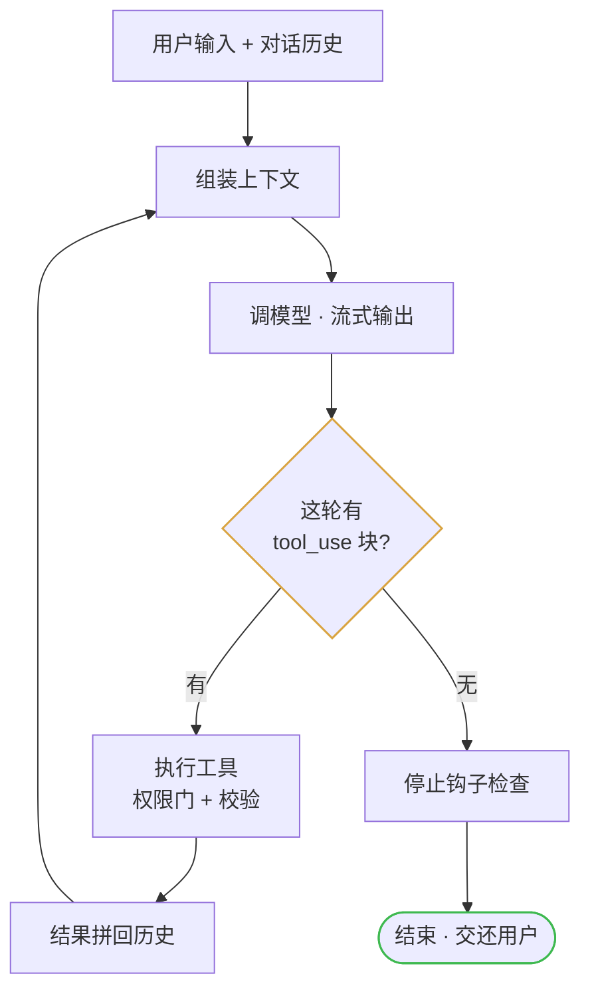
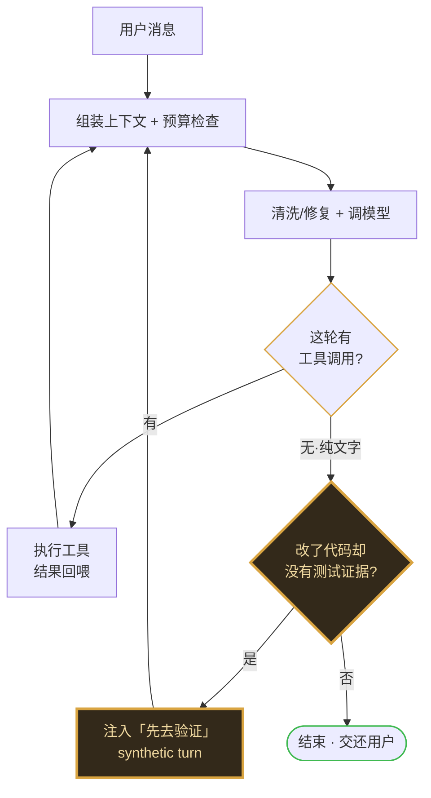

══════════ 01-inside-control-loop.html ══════════
〈title〉轴一 · 控制侧 · 核心 Agent Loop

`轴一 · Loop 之内 控制侧`

# 控制侧：核心 Agent Loop

*拆开 agent 那条「永不停歇」的主循环——它为什么转得下去，两家又在哪里分家。*

> **【TL;DR / 核心洞察】**
> 「连续工作」不是模型的能力，是壳造出来的幻觉——模型每一轮都被重新喂进整段历史、再被唤醒一次。壳用 三层防线 撑住循环：机械层（唤醒重发）、纪律层（写给模型的话、拦它偷懒）、强制层（用代码兜住出错与想停）。
> 机械层两家几乎同构； 分歧全在后两层 —— Claude Code 默认赌模型自觉， Hermes 用壳去补模型的不足。

本章只讲循环为什么转下去；上下文怎么拼、压缩怎么做见 02 章，输出块与错误处置见 03 章。

## 模型说完就死，「连续工作」到底从哪儿来

这一章不谈抽象循环，只追一件具体的怪事：模型明明「说完即死」，agent 却像不知疲倦。

【问题框】
  一个大模型每次调用只活一轮：你给它一段文字，它吐回一段文字，这次调用就结束了——它没有后台进程，也没有留在原地等下一步的能力。 说完，就死。 可我们看到的 agent 却能连着干几十轮：读代码、改文件、跑测试、看到报错再回去改，中途几乎不用你插手。这份不知疲倦的「连续工作」，到底是从哪儿来的？
  把这个「凭什么」拆开，其实是三个层层递进的问题。头一个：模型每轮说完就死， 壳凭什么能把它再叫起来一次 、让循环继续往下推？就算壳能一直叫醒它，第二个问题跟着就来了—— 模型凭什么不偷懒 ？它完全可以丢下一份计划、或一句「我这就去做」就想收工。最后，模型真要停下、或者眼看就要崩了（工具报错、吐出空响应、话说到一半被截断）， 壳又怎么兜住 、不让这一整轮的活白白报废？

头一个问题的机关其实很朴素：模型这一轮想调什么工具，壳就替它把工具真的跑一遍，把结果拼回那段对话历史，然后带着整段加长的历史再发起一次全新的调用。模型所谓的「记忆」，就是每一轮被重新喂进去的那份历史——两家做法一模一样。这三个问题的答案，正好对应壳的 三层防线 ：机械层负责唤醒、纪律层拦住偷懒、强制层兜住出错与想停。而两家从头一个问题起就开始分道——分歧最大的，是后两个。下面就逐层拆。
两个补充。其一，物理上「agent 在工作」，是壳在一段段地把一个生成器往前摇——正因如此，中断、压缩、恢复才能干净地插在两段调用之间。其二，会话越滚越长，迟早撑爆模型的上下文窗口；让长会话不爆窗口靠的是上下文压缩——那是维持循环能转下去的地基，细节留给 02 章。

## 第一层·机械续命：继续还是收工，只看一个开关

先看最底层的机械。两家的判断同构到近乎重合：模型这一轮只要调用了任何一个工具，壳就判定「话还没说完」，再发起一轮；一个工具都没调、只吐了一段纯文字，壳才认为它真的说完了，走收尾。 工具调用的有无，就是「继续还是停」的唯一开关 ——Claude Code 的注释直接把它称作 the sole loop-exit signal。
Hermes 在每一圈重发之前还多设了四道闸：这一回合的调用数没到上限、跨回合的迭代预算还有余额、没有收到用户中断、预算耗尽时是否还留着一次收尾调用——任何一道不满足，循环当场跳出。但主干上的那个开关，和 Claude Code 是同一个。

  〔图注〕开关只有一个：这轮有没有冒出 tool_use 块。有→继续；无→收工。壳默认不判断「活干完没」。
  〔图注〕唯一开关＝「模型没点工具」，这是仅有的正常终止 （过载切备用模型、413 压缩重跑等边缘分支见 §05）

  〔图注〕同一个开关，但重发前先过四道闸；且「没工具」也未必能停，还要过验证门。
  〔图注〕同一开关＋四道闸；「没点工具」还得过 verify-before-done 门 （工具名修复、空输出恢复、API 重试等见 §05）

## 三层防线全景：两家把力气押在不同的层

把三层防线摊平成一张图，最该看清的不是每条写了什么，而是 两家把力气押在了哪一层 。机械层几乎重合；分歧全在纪律层和强制层。
读法：机械层两家同构；纪律层两家都分层发放——按场景/功能加压是 共识 （CC 的自主模式与功能开关、Hermes 的编码岗与无人值守），真正只有 Hermes 有的是「按模型」这根轴（唯一黄标处）——因为 CC 只面对一个模型；强制层防死是共识（Hermes 兜得更低）， 防懒才是分歧 ——CC 默认 0 道、Hermes 编码入口默认 1 道验证门。每一层的续命都自带刹车（重试 3 次、nudge 2 次、预算 90 轮…）→ 见「反面」一节。
「三层」是我们为讲清楚而搭的分析框架，不是两家代码里的名词。 鼠标悬停任一词条，可见一句话解释。

## 第二层·提示词纪律：都看人下菜，只是看的不是同一个『人』

模型会偷懒。它会交出一份计划就想收工，会说一句「我这就去做」然后停手——这些是壳设计者反复见到的失败模式。两家的对策都是往系统提示里写「别罢工」守则，但关键在于： 没有一家对所有场合用同一份守则 。
Claude Code 的默认守则其实相当温和——失败别急着放弃、危险动作先确认（更硬的「如实汇报别谎报完成」只进了内部构建）。真正的高压话术全部锁在条件层：人不在场时才有「偏向行动别问」「终端在后台就大胆自主」；用户亲手开了功能才有「token 目标是硬下限」。 Hermes 的常驻守则是一句朴素的「把活干完、别交桩」；更狠的「必须立刻调工具、别用一句承诺结束回合」只喂给一份 弱模型名单 （gpt、codex、gemini、gemma、grok、glm、qwen、deepseek 八家），而 Claude 这类强模型反倒不注入。
触发：默认常驻。基调温和——先诊断、别乱重试，也别一次失败就放弃一条可行的路。
触发：默认常驻，对所有模型家族都注入——既防早停，也防造假。
触发变量＝人在不在场：自主／后台模式、或上下文带 token 目标时才注入。
触发变量＝模型强不强：模型名命中弱模型名单才注入，Claude 这类强模型不加。
四格摆在一起，差别不在「加不加压」——两家都按场景和功能分层加压（CC 有自主模式，Hermes 有编码岗守则和无人值守协议）——而在 Hermes 比 CC 多出一根加压轴 。Claude Code 只面对一个自家托管的模型，「模型行不行」根本不是变量，它的条件层主要跟着「人在不在看」走：终端前台还是后台、交互还是自主。Hermes 要跑一整群第三方模型，「模型行不行」就成了它独有的第一变量——纪律按模型名单发放，弱的多压、强的少压。
连催促待办的方式也照这条线分。 Claude Code 的壳会在待办搁置太久时周期性塞一句软提醒（旧版待办工具还在每次回执后附一句「请继续推进」）； Hermes 刻意不让待办挂任何提示——引导只写在工具说明里，把主动催促的额度留给记忆蒸馏和技能自造（见轴二）。
诚实边界：Claude Code 生态里最锋利的那段话术——「回合结束前，检查你最后一段是不是一句没兑现的承诺」——并 不在 CLI 代码库里 。它是 Agent SDK／多智能体运行时另外叠加的一层，详见文末悬而未决。

## 第三层·壳的强制：防死是共识，防懒是分歧

前两层管「该不该继续」，第三层管「拦不拦得住意外」。模型随时可能「死」：工具抛错、吐出空响应、话说到一半被截断、API 调用失败。两家的壳都不让它真的死——把错误包成一条工具结果回喂给模型，让它自己看到报错再改，然后重试、切备用模型、压缩后重跑。 Hermes 兜得更低：连空输出、只思考不说话、工具名拼错、参数 JSON 损坏、流被网络掐断，都各有一条专门的恢复路径——弱模型的种种毛病，壳都得替它治。
每一类错误具体怎么处置，是 03 章的事。这里只需记住一件事： 在两家眼里，错误都不是终点，是下一轮的输入 。
分歧出现在「防懒」。模型想收工——不调工具、交出一段纯文字答案—— Claude Code 默认放行，一道完成度检查都没有； Hermes 默认设一道验证门。这道门最能说明「可靠性焊进壳、而不是托付给权重」，值得逐帧拆开看：模型说「我修好了」，只是一个待核实的 声明 ，不是结论。

【分步演示 stepper】
  〈帧 1〉模型输出 「我已修复登录 bug ✓」 —— 纯文字，无工具调用 壳的第一反应 暂定为最终答案？先别急着交给用户
  〈帧 2〉壳提问 ① 这一轮到底改没改「真代码」？ 过滤器 README / .md / LICENSE → 判定为文档，豁免
  〈帧 3〉壳提问 ② 查验证台账：编辑之后 有没有「测试/lint/build 跑绿」的新证据？ 台账结果 —— 空 —— 没有任何通过记录
  〈帧 4〉壳注入的 nudge · 模型可见 / 用户不可见 [System: You edited code in this turn, but the workspace does not have fresh passing verification evidence yet. Verification status: unverified Changed paths: - `src/auth/login.py` Run the relevant verification command now (`pytest`, ...), read any failure, repair the code, and summarize what passed. If verification is not possible, explain the concrete blocker instead of claiming the work is fully verified.] 模板原文 · 路径与命令为运行时填充（verification_stop.py） 这条系统消息用户看不到（synthetic 标记），只对模型可见——它把模型的「我做完了」原地驳回，逼它回去真的跑一次验证。
  〈帧 5〉拼回历史 模型的「我做完了」+ 这条 nudge 都追加进去（对用户隐藏） 关键动作 continue —— 而不是 break 循环被重新打开
  〈帧 6〉模型被迫再跑一圈 这次真的去调用测试工具 放行条件 证据转绿 ✓ 或 nudge 预算(2)用尽 → 才允许 text 答案 break，交还用户
  〔字幕〕

## 反面：每个续命机制都自带刹车

无限续命等于无限烧钱。真正的产品智慧不是「一直续」，而是 分清两种失败 ：可恢复的失败（空输出、网络断、工具名拼错）值得猛续，确定性的失败（安全拒答、鉴权错误、压缩也救不回）就该干净地停——重试一个确定性失败，只会把它原样复现一遍。下面这张表把两家的每个刹车并在一起看。

  【矩阵】 维度 | Claude Code | Hermes
  · 轮数天花板
      [Claude Code] 交互模式默认 无上限 ——设计上就让它跑到活干完；轮数上限仅装在自动化路径（--max-turns 只在 --print 模式生效，后台 fork 封顶 200 轮）。
      [Hermes] 迭代预算 父 90／子 50 、按 agent 计；耗尽后不是硬切，而是剥掉所有工具、做一次收尾总结调用。
  · 恢复类重试上限
      [Claude Code] 截断续写 3 次；反应式压缩每轮只试 1 次（试过就锁住，救不回就抛出去）。
      [Hermes] 空输出 3、坏 JSON 3、拼错名 3、nudge 2、prefill 2—— 清一色个位数 。
  · 熔断
      [Claude Code] 压缩连续失败 3 次即停 ，本会话不再尝试。 不熔断会「每轮对 API 发起注定失败的压缩请求」，无限空转烧钱。
      [Hermes] 429 限流写入一个所有会话共享的冷却文件（默认 300s）；工具打转监测 默认只警告 ，硬停是 opt-in。
  · 确定性失败不续
      [Claude Code] API 错误被 刻意 排除在停止钩子之外——踩过「错误→阻断→重试→又错误」烧掉上千次调用的死亡螺旋。
      [Hermes] 安全拒答（content_filter） 绝不重试 ，如实呈现给用户；顶多换一个备用模型试一次。
  · 人的总闸
      [Claude Code] 用户中断随时凌驾一切续命；权限门卡住 每一个 动作，不在允许模式内就弹确认。
      [Hermes] 每圈顶先查中断；退避等待期间也 每 0.2s 查一次 ，保证长退避里也能被打断。
  · 防空转
      [Claude Code] token 预算下续跑几轮后、连续两轮增量 <500 就判收益递减、主动早停；心跳模式没活必须睡，不许回「还在等」白烧一轮。
      [Hermes] 编排调用（execute_code）与压缩重试等系统内务 不吃预算 （退还），不让杂务烧掉有限的续命额度。

## 谁在防它罢工：一个赌模型自觉，一个用壳补模型

三层防线上的投入分布 ：机械层同构；纪律层 都看人下菜，但看的变量不同 ——一个看场景（人在不在场），一个看场景加模型（还看名单）；强制层防死是共识、防懒是分歧（Claude Code 默认 0 门、Hermes 默认 1 门）。归因还是那条信任线： Claude Code 押注一个可控的托管模型——模型够强，纪律就能温和，防懒就能交给模型自觉； Hermes 面对的是一群良莠不齐的第三方模型——纪律得按名单发放，防懒只能焊进壳里。
一个反直觉的落点 ：做模型的那家，反而 更不信任 模型说的「我做完了」。越清楚权重的脾气，越不敢把「完成」的判断权交出去。
往下一章看 ：Claude Code 加压的那个变量——「人在不在场」——不是本章的终点。这根线在轴二「Loop 之外」会长成一整条 脊椎 ：壳怎么随人的在场与否，动态调整它对模型的信任与放手。

## 悬而未决：九条别被主线吞掉的边界

【悬而未决 / 防夸大】
  - [CC] 生态里最强的「别罢工」话术（回合结束前检查最后一段是否是未兑现的承诺、只有任务完成或卡在用户输入才准结束） 不在 CLI 源码里 ——它是 Agent SDK／多智能体运行时的叠加层。CC 的纪律像一颗洋葱：核心 CLI 温和、外层运行时逐层加压；本章只对 CLI 仓库负责。
  - [CC] token 预算的「还剩多少」倒计时有一部分在 服务端渲染器 里算——「改壳 vs 改模型」二分之外，其实还有第三个位置：服务端提示层。
  - [CC] 系统提示里有一句给模型的心理托底：系统会自动压缩历史，「你和用户的对话不受上下文窗口限制」——防的是模型因怕爆窗口而草草收敛。
  - [CC] 验证代理契约（非平凡改动须独立验证代理裁决）还在灰度特性门后——CC 正朝 Hermes 的验证门方向收敛，但今天还不是默认。
  - [CC] 工具能在模型还没说完话时就开始执行（边流式边执行），是延迟优化不是模型行为；子 agent 复用同一套循环引擎递归调用。
  - [HM] 工具打转熔断 默认只「警告」不「硬停」 ——Hermes 的默认姿态其实偏「让它试」，硬熔断留给用户 opt-in，别把它想成处处铁腕。
  - [HM] 迭代预算按 agent 计：父 90＋每个子 50，系统总迭代可远超 90；预算耗尽不是硬切，而是剥掉工具讨一次收尾总结。
  - [HM] 验证门 surface-aware：纯文档改动豁免；Telegram／Discord 等聊天入口默认关——「可靠性纪律」本身是 按产品场景发放 的。
  - [HM] 用户中途插话不必等回合结束：Hermes 有带外消息通道，把插话贴在最近一条工具结果尾部，并教模型「把它当与原始请求同等权威的指令」。这条「人怎么在跑动中转向一个 loop」的线在轴二 05 章展开。
