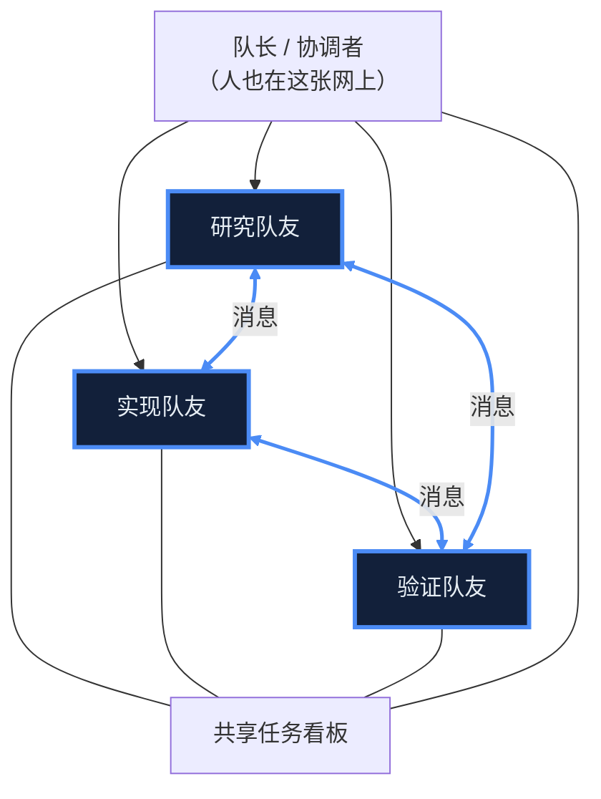
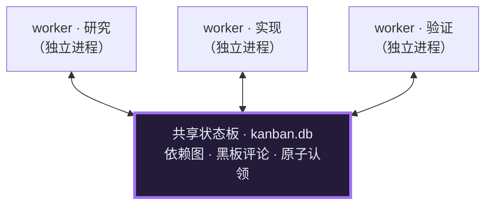

══════════ 07-outside-multiagent.html ══════════
〈title〉轴二 · Loop 之外 · Loop 与其他 Agent：为几乎相同的理由拆开，却在拆开之后分道扬镳

`第 7 篇 · 轴二 · Loop 之外 Loop 与其他 Agent · 多智能体协作`

# Loop 与其他 Agent：为几乎相同的理由拆开，却在拆开之后分道扬镳

*单个 agent 的上下文与时间总有极限——拆成多个分身是必然。真正分野的，是拆开「之后」。*

> **【TL;DR / 核心洞察】**
> 多 agent 不是为了「更聪明」，是被上下文极限逼出来的手段——两家都提供三种模式：自己干、派一个隔离分身替你干一段、组一支共用看板的团队。 模式清单相似，不是差异所在。
> 真正的产品判断，不在「有哪些模式」，而在 什么时候该拆、什么时候升级、谁来决定 ——这一层两家分道。本章像一份产品报告，按 一个任务被拆开、干完、合回来 的顺序走：为什么拆 → 有哪些模式 → 何时拆（脊）→ 派出去的代价 → 分身怎么协调 → 怎么合回来。不碰「谁假设有人在场盯着」那根线——那是综合②的活。

## 00 · 问题：一个 agent 干不完的活，拆开之后谁跟谁怎么协调

【问题框】
  你交给它一个大活：把一个中型仓库从一套框架整体迁到另一套，顺带补全测试、更新文档。 一个 agent 干不完 ——光是把相关文件逐个读进来、逐个尝试、逐个回滚，几十上百轮工具调用的原始输出就把它的上下文塞爆了，它开始「健忘」，也拖到你等不起。于是它把活拆开，派出几个分身各干一段。 拆开这一步，两家几乎一样 ；可真正的问题从拆开之后才开始： 什么时候才真该拆、拆出来的分身带着什么代价、它们之间靠什么协调、干完又怎么合回一个连贯结果 ？下面按这个顺序，一件件摊开。

## 01 · 为什么非拆不可：两家给出的理由几乎逐字重合

_要理解分野，先得承认起点是 趋同 的。两家在提示词里自认的「为什么要多 agent」几乎一模一样：核心不是分工，而是 防中间原始输出淹没父的上下文 ——把一段会产生大量一次性输出的子任务派出去，只让摘要回来。_
Claude Code 的 subagent 机制上也是隔离的——子在自己的子进程里跑、只把一条结果回你，护上下文是这个机制的自然结果。把这层判据讲得最直白的，是它 fork 实验里的一句质性问题（不是「任务大不大」，而是「这些中间输出我以后还要不要」）：

  ┌─ 制品 · CC · 何时该拆（fork 自己 · 灰度实验）· 原文
  │ Fork yourself ... when the intermediate tool output isn't worth keeping in your context. The criterion is qualitative — "will I need this output again" — not task size.
  └─
Hermes 把同一件事讲成一句机制承诺——中间结果根本不进你的窗口，只回摘要：

  ┌─ 制品 · HM · 委派的意义 · 原文
  │ Only the final summary is returned -- intermediate tool results never enter your context window.
  └─
连「 何时不该拆 」也趋同：目标已知就直接读、单个工具调用直接调、机械活别专门开一支队伍——两家都在提示词里劝模型别为拆而拆。 这一层是全章最没有分歧的地方 ，本章不在这里制造对立。既然「为什么拆」趋同，先把「有哪些协作模式」这张地图铺开——你会发现两家的模式清单也高度相似。

## 02 · 有哪些协作模式：三种，而不是一条阶梯

_把多 agent 能力摊开，真实结构是 三种模式 ：自己干、派一个隔离分身替你干一段、一群分身共用一块看板协作。 注意：并行、嵌套这些不是独立模式，是「委派」这一种模式的用法参数——能同时发生（比如一次并行派 3 个后台分身）。 下面逐个讲清： 干嘛用、什么时候触发、CC / HM 触发后的特性差异 。_
干嘛用 ：目标明确、机械活，自己直接做最省——多拆一个分身都是白白的 token 与协调开销。 什么时候触发 ：目标已知、单个工具能解决、不会产生海量中间输出。 特性 ： CC → 直接 Read / Glob； Hermes → 直接 execute_code。
干嘛用 ：把会产生大量中间输出的子任务派出去，只让 摘要 回来，别让原始输出淹没父的上下文。 什么时候触发 ：中间产物会塞爆上下文、或有真正独立可并行的活。这是两家真正的主力能力（ CC 的 AgentTool、 Hermes 的 delegate_task，都无门控常驻）。
下面这些 不是互斥的档，是同一次委派的用法参数——能同时发生 ，触发后的特性差异才是两家分野所在：

  【矩阵】 用法参数 | Claude Code | Hermes
  · 数量
      [Claude Code] 派一个 / 一条消息里并行派多个（fan-out）。
      [Hermes] 派一个 / tasks 数组批量并行。
  · 前台还是后台
      [Claude Code] 模型按依赖 临场选 ：前台等结果，或后台并行。
      [Hermes] 默认 后台异步 、模型不能选（老参数已废弃）。
  · 能否再嵌套
      [Claude Code] 默认扁平——teammate 不能再派 teammate；要嵌套编排须开 coordinator。 灰度实验
      [Hermes] 默认扁平（层深上限 1）——子 agent 也不能再派；要嵌套须显式把 max_spawn_depth 抬到 ≥2。
  · 上下文共享
      [Claude Code] 默认 fresh 零共享。 灰度实验 fork＝继承父上下文的分身。
      [Hermes] 一律 fresh、无父历史，靠 context 字段手搬。
  · 隔离强度
      [Claude Code] 同 cwd → 独立工作树 → 远程沙箱（默认弱、可升级；远程档仅内部构建可见）。
      [Hermes] 同进程线程 → 独立 OS 进程（按 profile 隔离）。

干嘛用 ：多个分身要长时间协作、互相交接、把成果汇聚成一个连贯结果。 什么时候触发 ： CC 灰度实验 需开启 agent-swarms（feature flag），普通用户默认见不到——连它的 coordinator 编排、peer 跨机也都在这道门后； Hermes 靠 hermes kanban / profile 显式命令进入 （真产品入口）。 特性差异 ： CC ＝具名队友＋共享任务看板＋队友互发消息； Hermes ＝kanban / swarm＋共享黑板＋依赖图＋固定角色链。这块的分身 到底怎么连 ，留到 §05 那张图细看。
两处真非对称，各接住一段部署底色： CC 的 fork （ 灰度实验 要个续着我思路干、却不弄脏我上下文的分身）、 Hermes 的 profiles （把「角色」做成完全独立的实例，横切所有模式——接住它自托管、单机多实例的部署形态）。

  ┌─ 制品 · CC · fork 继承父上下文（灰度实验）· 原文
  │ it inherits your full conversation context ... keeps its tool output out of your context
  └─

  ┌─ 制品 · HM · profiles＝隔离实例花名册 · 原文
  │ Each profile is a fully independent HERMES_HOME directory with its own config.yaml, .env, memory, sessions, skills, gateway, cron, and logs.
  └─

## 03 · 何时拆：拆不拆 · 拆多重 · 谁来判断——这一层才是产品判断的心脏

_机制清单只是坐标系，真正的产品判断在「何时动用」。每拆一个分身，都多一份 token、多一份协调、多一个跑偏风险，还丢了主 agent 的上下文连续性。所以「何时拆」不是一个点，是一条有三个刻度的线——两家在第一个刻度 趋同 ，在后两个 分道 。_
什么时候真该拆、什么时候单 agent 就够——两家几乎逐字重合地划同一条「别滥用」的红线。
  - 中间产物会淹没父的上下文
  - 有真正独立、可并行的活
  - 推理密集、需要独立思考的子任务
  - 机械活——别专门派一支队伍
  - 单个工具调用能解决——直接调
  - 目标已知——直接读，别绕分身

  ┌─ 制品 · CC · 判据是质性、不是任务大小（fork 灰度实验）· 原文
  │ Fork yourself ... when the intermediate tool output isn't worth keeping in your context. The criterion is qualitative — "will I need this output again" — not task size.
  └─

  ┌─ 制品 · HM · WHEN TO USE · 原文
  │ Reasoning-heavy subtasks · Tasks that would flood your context with intermediate data · Parallel independent workstreams
  └─
这处趋同本身就是产品逻辑： 多 agent 不是越多越好 。两家设计者站在同一条线上劝模型别为拆而拆——因为背后是同一个物理约束：上下文稀缺、协调有代价。
从「派个分身」到「组一支团队」是一次质变。什么时候值得升级？两家给模型的引导完全不同——但要留意： CC 的组队本身还是灰度实验，对普通用户默认是关的 ，所以这条引导目前只在实验开关背后生效。

[Claude Code] Claude Code · 提示词层鼓励主动组队 灰度实验

  ┌─ 制品 · CC · 拿不准就倾向组队 · 原文
  │ Use this tool proactively whenever ... When in doubt about whether a task warrants a team, prefer spawning a team.
  └─

[Hermes] Hermes · 不教择时，重协作是要人显式走进去的入口
  提示词里 没有 「何时从 delegate 升级到 kanban」的择时语句；重协作靠 hermes kanban / profile 显式进入——是一条独立路径，不是模型临场就能走上去的。

同样是「派一个分身」，「它该同步等结果、还是后台异步跑」这个决策放在哪一层——交给模型临场判断，还是写死进壳？

  ┌─ 制品 · CC · 前后台交给模型质性判断 · 原文
  │ Foreground (default) when you need the agent's results before you can proceed ... background when you have genuinely independent work to do in parallel.
  └─

  ┌─ 制品 · HM · 委派恒后台、模型不能选 · 原文
  │ BOTH MODES RUN IN THE BACKGROUND ... Do NOT wait or poll
  │ 老 background 参数：DEPRECATED / IGNORED — you do not need to (and cannot) opt in or out.
  └─
别读成「CC 全交模型、Hermes 全固化」——两边都有反例：CC 也有硬规则（fork 模式下所有分身 恒后台 ），Hermes 也给模型该拆 / 不该拆的清单。 准确的差异只落在「委派该不该后台异步」这一个具体决策上 ：CC 默认前台＋模型选，Hermes 默认后台＋模型不能选—— 一个信任模型临场决策，一个把决策沉淀成壳的默认。

## 04 · 派出去之后：分身带着什么代价干活

_分身派出去了，它带着几笔 代价 在外面干活：父信不信它自报的「我做完了」、它烧多少 token、它够不够得到你。第一笔最能照出两家的态度分野，也直接呼应轴一里两家对「自报」的整体态度——姿态正好相反。_

[Claude Code] Claude Code · 默认信任，只有编排模式才另加核验层
  子分身的输出 默认就该信 ——这是常规提示词里的原话、不受任何实验开关门控。 只有 显式开启的 coordinator 编排模式（灰度实验），才会额外插一层独立验证角色，并且强调验证要证明代码真能跑、不是盖章走过场。

  ┌─ 制品 · CC · 子输出默认可信（常规·非门控）· 原文
  │ The agent's outputs should generally be trusted
  └─

  ┌─ 制品 · CC · 唯编排模式才加的核验纪律 · 原文
  │ Verification means proving the code works, not confirming it exists. A verifier that rubber-stamps weak work undermines everything.
  └─

[Hermes] Hermes · 默认不信，把「亲自复核」焊进委派工具本身
  子分身的摘要被当成 自报、不是已核实的事实 ——这是委派工具的常态纪律，不是某个模式才开：要求子分身回一个可核验的凭据（URL / ID / 绝对路径 / HTTP 状态），父 自己去验 。

  ┌─ 制品 · HM · 摘要是自报、须亲验 · 原文
  │ Subagent summaries are SELF-REPORTS, not verified facts ... require the subagent to return a verifiable handle (URL, ID, absolute path, HTTP status) and verify it yourself
  └─

【VERDICT】
  为何相反： CC 把默认信任当基线、按需在编排模式加核验； Hermes 把默认怀疑写进委派常态。这正是轴一「对任何自报不全信」的态度在多 agent 场景里的延续——不是新立场，是同一立场的贯彻。

其余两笔代价，两家趋同。 成本 ：都对烧钱敏感、只是抓手不同—— CC 优化缓存命中（fork 保持字节级相同的前缀、复用 prompt 缓存，还叮嘱别乱设模型）， Hermes 优化上下文预算（按父剩余额度的一半再除以批量裁剪每条摘要，并发默认 3、超 10 个警告成本线性上涨）。 够不到用户 ：两家的分身都 联系不上你 ——CC 异步 agent 的工具白名单里没有「问用户」，Hermes 直接把 clarify 硬 block 掉，结论都必须由父转达。 隔离 （各自沙箱、防互踩）是每一级都能拧的旋钮，已在上一节阶梯的横切条里交代。

## 05 · 分身之间怎么协调：一张互发消息的同事网，还是一块只读写的共享状态板

_分身各自在外面干活，它们之间靠什么彼此协调？这是全章 形状差异最大 的一处。若不画出来，容易把两家的团队笼统当成「都是多 agent 协作」，看不出根本的形状差异。这张图的读法很直接： 看分身之间有没有直接连线 。 提醒 下文 CC 这套团队 / 编排协作属 §02 说的灰度实验，Hermes 的 kanban / swarm 是显式产品命令；这里只比协调的形状。_

  〔图注〕具名队友之间有双向消息箭头；人当队长，也在同一张网上。
  〔图注〕高亮＝队友↔队友的消息箭头（蓝色粗线）。图注：具名队友 · 邮箱互发消息 · 共享看板并存。

  〔图注〕独立进程之间彼此没有连线；全部只连到中央那块持久状态板。
  〔图注〕高亮＝中央共享状态板，且 worker 之间无任何连线（紫色粗描边）。图注：独立进程 · 不互发消息 · 只靠读写共享板协调。

  ┌─ 制品 · CC · 队友靠消息才听得见彼此 · 原文
  │ Your team cannot hear you if you do not use the SendMessage tool.
  └─

  ┌─ 制品 · HM · 协调靠写在根任务上的低技术黑板 · 原文
  │ The shared blackboard is also deliberately low-tech: structured JSON comments on the root task.
  │ Put cross-worker notes on the root task using structured comments.
  └─
遮住标题看形状：左图分身之间 有 箭头，右图分身之间 没有 （只各自连中央板）。这就是根本差异—— CC 的团队层是「消息网＋共享看板」并存，分身彼此直接通话； Hermes 是「纯共享状态」，分身不互发消息、只把交接留在那块持久的板子上，让协作可以脱离某个具体的父自转。
但别把它读成「一方能盯、一方黑盒」： 可监督性上两家其实趋同 ——都能旁观、暂停、打断单个分身。差异只在分身 彼此之间 怎么传话，不在你能不能看见它们。

## 06 · 干完怎么合回来：成果的回流、汇聚与落地

_分身跑完，成果怎么回流、谁把几份结果并成一个连贯输出、落到哪、还留不留？fan-out 是「怎么拆」，这一节是「怎么合」——而成果的去向，恰好照见上一节协调的形状。_
最能照出分野的，是 谁来把几份结果并成一个连贯输出 ——这一步两家的姿态截然不同：

[Claude Code] Claude Code · 父 / 协调者亲自综合，明令不可外包
  综合是父 最重要的活 ，绝不把「理解」转交给另一个 worker——理解必须留在中心节点手里。

  ┌─ 制品 · CC · 综合不可外包 · 原文
  │ Always synthesize — your most important job ... You never hand off understanding to another worker.
  └─

[Hermes] Hermes · 把「综合」做成拓扑里一张专职角色卡
  swarm 里 synthesis 不是父的专属职责，而是依赖链末端 一张独立的 synthesizer 卡 （前面还有 verifier 卡把关 pass / block）——综合被 外化成拓扑的一个角色 。

  ┌─ 制品 · HM · 综合是拓扑末端一张卡 · 原文
  │ parallel specialist workers → verifier (todo until all workers done) → synthesizer (todo until verifier done)
  └─

合回来这一步再次印证了协调的形状： CC 一切回流到 父这个中心节点 、连综合都焊在父身上； Hermes 把成果沉进一块 可脱离父自转的共享状态板 、连综合都外化成拓扑里的一张卡。 本章到此为止，只描述形态、不评孰优 ——也不碰「谁假设有人在场盯着」，那是综合②独占的总变量。

## 07 · 悬而未决 · 边界与降位说明

【悬而未决 / 防夸大】
  - [CC 跨机 peer＝实现缺失] CC 的提示词层与寻址解析层都写了「跨会话 / 跨机器给别的 agent 发消息」，但 传输层与发现层在当前源码树中缺失、全树搜不到 ——不能端到端闭环。本章不把它当既成能力，凡提到均按「当前代码树未闭环」读。（另有一道跨机安全门：跨机器桥接消息需用户显式同意、且免疫绕过开关。）
  - [可监督性两家趋同] 都能旁观 / 暂停 / 打断单个分身（CC 团队面板＋叫停，Hermes /agents 浮层＋远程调用叫停）。别写成「CC 能盯、Hermes 黑盒」。
  - [外来 agent 互通都非既成] CC 跨会话仅走本地套接字 / 桥接（且见上，未闭环）；Hermes 有 ACP，但 仅出向 （配置驱动、把外部 provider 当子后端、对模型隐藏），不是通用的入向 agent 互通花名册。
  - [降位的支线机制] 以下均非本章主线分岔，仅在此交代、不进重 / 中档：CC 的 observer / AgentSummary / 夜间 DreamTask；Hermes 的 MoA（ 多模型集成、不是多 agent ，默认关）、batch_runner（离线批处理、非运行态）、同进程内 teammate；以及 CC 的远程沙箱档位（隔离升级的一档，非协作拓扑本身）。
  - [不评优劣 · 版本切片] 本篇讲「拆开之后怎么协调」的 形态差异 ，不评孰优——取决于你要的是围绕中心 agent 的团队，还是一台可自转的共享状态机。切片：CC 真源码树 / Hermes @8e734810d。
