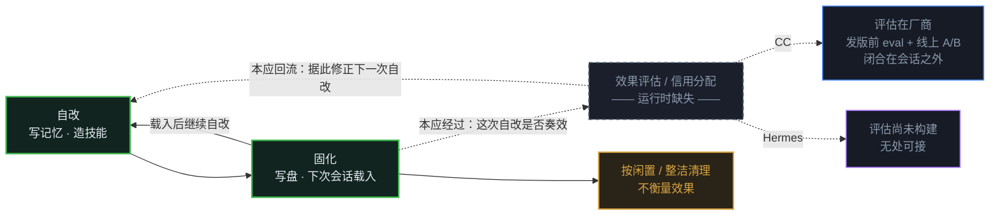

══════════ 08-outside-self-improvement.html ══════════
〈title〉轴二 · Loop 之外 · Loop 的 self-improvement

`第 8 篇 · 轴二 · Loop 之外 控制回路 · 积累环闭合 · 评估环断口`

# Loop 的 self-improvement：自改的手段都在，评估的环节缺席

*两家都能改写自己、都会把经验写回下一轮——却都没有一段代码，回头确认这次自改到底改对了没有。*

> **【TL;DR / 核心洞察】**
> 自我进化看起来像训练问题，其实是一个 控制回路 问题。两家都具备自改的手段（写记忆、造技能）和固化的机制（写盘、下次会话载入）， 积累这半个回路是闭合的 ——写入的经验，下一轮一定会被重新读到。
> 缺的是 评估 这一环： 没有任何代码在一次自改之后，去检验它是否真的改善了后续结果 。评估缺席，回路就无法真正闭合。差别只在这一环由谁来补： CC 把评估外包给厂商， Hermes 拥有模型、却尚未把评估构建出来。

## 00 · 问题：自我进化，进化的是「变好」还是「变大」

【问题框】
  「自我进化」是这类 agent 最诱人的一个承诺：用得越久，它越懂你、越能干，仿佛会自己成长。这个画面背后藏着一个更基本、也更少被追问的问题—— 一个 agent 说自己在自我进化，它究竟在进化什么：是真的变得更好，还是只是攒下越来越多的东西？
  两家确实都在不停地往磁盘写记忆、造技能，下次开机再读回来，积累这件事实打实地转着。但 攒得多，不等于变得好 。于是真正的问题落在一个很具体的地方： 有没有哪一段代码，在一次自改之后，回头确认过这次改动真的让后来的结果变好了？ 这一章要挖的，正是被「自我进化」四个字盖住的这道缺口——它到底在闭合哪半个回路。

## 01 · 先厘清一个误读：你的使用没有在重训它的权重

_Hermes 把自己写成「self-improving」，README 第一句就自称自带学习闭环。最容易产生的误读是「你每天跟它聊天，就在实时重训它的权重」——这个读法不成立，两家代码都不支持。_
Hermes 的训练管线吃的是研究员策划好的数据集；跑批量时把持久记忆整个关掉、也不自存轨迹，轨迹压缩是离线后处理——跟你的活会话之间， 没有一根自动接线 。

  ┌─ 制品 · Hermes · 批量训练管线：吃策划集、封住记忆、不自存轨迹
  │ save_trajectories=False,   # We handle saving ourselves
  │ skip_memory=True,          # Don't use persistent memory in batch runs
  │ dataset_file (str): Path to the dataset JSONL file with 'prompt' field
  └─
Claude Code 那边更干脆：仓库里 grep 不到一行训练代码。唯一沾边的是转录上传，要你逐次点头、非匿名、上传前脱敏——它自己的注释把这件事定义成「给厂商 攒训练数据 」，你的使用是喂给一条你看不见的外部流水线的原料，不是它自己能闭合的循环。

  ┌─ 制品 · Claude Code · 注释：这是为「训练数据收集」而做，别浪费标注员时间
  │ For training-data collection, a model response conditioned on synthetic placeholders is tainted — fail the trajectory rather than waste labeler time on a turn that will be rejected at submission anyway.
  └─
但这个最窄读法从来不是有意思的问题。就算脑子冻结，Hermes 确实有一套 真的 学习回路——攒记忆、造技能、回灌下次会话，CC 也有。真正该问的是： 这套回路是让它变好，还是只让它变大？

## 02 · 自我进化是一个控制回路，两家只闭合了积累半环

_把「自我进化」摊开，它是一个有若干环节的控制回路：先定义什么算「变好」（目标 / fitness），再发现问题（误差信号），再动手自改，再 评估 这次自改是否奏效（信用分配），最后把有效的经验固化上线、进入下一轮。 本章只盯评估这一环 。_
两家的自改与固化都真接通了——自动抽取记忆、后台造/改技能，直接写进磁盘，下次会话开场就载入进系统提示。积累这半个回路是实打实转起来的。（记忆怎么攒、怎么懂你，是第 5 篇的事；这里只看回路闭没闭。）

  〔图注〕实线是 积累环 ——自改与固化两步彼此闭合，两家都真的转起来。虚线是 评估环 ：一次自改之后本应经过「效果评估」、再回流修正下一次自改，这个环节在运行时并不存在，回路因此没有真正闭合。琥珀那条只按年龄清理、不衡量效果。
  〔图注〕术语： 信用分配 ＝把后续结果的好坏归因到之前某次自改（这次自改是否奏效）； 效果评估 ＝据此判断该保留、强化还是撤回。回路里的「载入 / 清理」是常识，不再解释。

这张图的读法很直接：实线的 积累环 是闭合的，而本应嵌在回路里的 评估环 （虚线）在运行时并不存在——一次自改之后，没有代码回头判断它是否奏效。下面两节，先证「评估环两家都缺」，再看「缺法为什么不同」。

## 03 · 评估环缺席：没有代码检验「这次自改是否奏效」

_造了技能、写了记忆之后，没有任何一段代码回头衡量「这次自改是否改善了后续结果」。两家一样。最有力的证据不是我转述，是系统自己的话。_
Hermes 的技能整理器，在它自己的 prompt 里直接承认：用得多不多，根本证明不了一个技能有没有价值。而后台复盘的 prompt 又把「这一轮没写东西」定义成失败——它要的是 多写 ，不是 变好 。

  ┌─ 制品 · Hermes · curator prompt：使用次数不是价值信号
  │ 'use=0' is not evidence a skill is valuable; it's absence of evidence either way.
  │ Corollary: 'use=0' is ALSO not a reason to PRUNE a skill.
  └─

  ┌─ 制品 · Hermes · background review prompt：没写东西 ＝ 错过机会（隐含目标是多写）
  │ Be ACTIVE — most sessions produce at least one skill update, even if small. A pass that does nothing is a missed learning opportunity, not a neutral outcome.
  └─
把「量没量效用」逐条并排，三处都是同一个空缺：

  【矩阵】 — | Claude Code | Hermes
  · 技能造完 之后回收吗
      [Claude Code] 造技能向导造完只告诉你存哪了、怎么调用、可自行编辑—— 无任何效果回收 。
      [Hermes] 技能遥测只记 use / view / patch 计数与时间戳， 没有成功 / 评分 / 有用性字段 ——用得多但结果烂的技能，和好技能 分不出 。
  · 收到的反馈 信号去哪了
      [Claude Code] 记忆调查确实弹 good/bad（20% 抽样），但信号 只落 analytics 事件 、不回流去选记忆。
      [Hermes] 复盘把「写成功」当成功—— 写工具返回 OK 就算 ，从不看下游结果好坏。
  · 谁在做减法 按什么轴
      [Claude Code] 夜间整合的剪枝是 卫生式 ：去重、消矛盾、删陈旧、把索引压到 200 行 25KB，没有效用维度。
      [Hermes] 技能整理器 纯按闲置时长 剪（30 天转 stale / 90 天归档）、按内容重叠合并（默认关），明令别拿使用数当价值。

说清楚一件事，免得矫枉过正：这不是「两家都不做选择」。两家都在剪枝、都有选择压力——只是 选择的轴是整洁与新鲜，不是好坏 。也别把「回合内的质检」误当信用分配：CC 有专门的核验子代理、Hermes 会在会话内捕捉你的纠正和挫败线索，那测的是 单个任务里对不对 ，不是「我这次跨任务的自改，让后来变好了没」。（写入侧那些护栏——审批闸、防漂移——都是负向、事故驱动的，属第 5 篇。）

## 04 · 评估环的两种缺法：一个外包给厂商，一个尚未构建

_自改的手段两家都有，分野出在评估： 运行时都没有评估，但缺的方式不同 。这是本章最关键的一处非对称，别当成两家一样。_

  【矩阵】 — | Claude Code | Hermes
  · 自改 由谁触发
      [Claude Code] 留给人 ：造技能向导只对内部员工开、且只能人手动调，模型不能自触发。
      [Hermes] 自动化 ：后台复盘定期自动写记忆 / 技能（按回合节奏触发、非每回合），不等你开口。
  · 运行时 有无评估
      [Claude Code] 空 。
      [Hermes] 空 。
  · 评估 实际在哪
      [Claude Code] 在别处、而且是真的 ：发版前的实验室 eval ＋ 厂商拿线上做 A/B ＋ 在场的人逐次当裁判。
      [Hermes] 哪都没接 ：拥有模型、造了最自主的自改机器，改进回路却最不闭合。

CC 把评估外包得很彻底，而且这套评估是真的。记忆相关的 prompt 里到处标着「Eval-validated」，某条排除规则旁边就注着一个 eval 案例从 0/2 跑到 3/3——说明这些措辞是在实验室里用离线跑分调出来的。但那些 eval 文件不随产品发货：它约束的是 发版前的 prompt ，不是 你会话里的运行时行为 。CC 的改进回路确实闭合——闭在厂商的发版节奏上，不在你的会话里。

  ┌─ 制品 · Claude Code · 记忆 prompt 旁注：某条规则由一次 eval 案例验证（0/2 → 3/3）
  │ // H2: explicit-save gate. Eval-validated (memory-prompt-iteration case 3, 0/2 → 3/3): prevents "save this week's PR list" → activity-log noise.
  └─
Hermes 恰恰相反：它拥有模型、造出了最自主的自改机制，改进回路却最不闭合——训练管线是真的，但吃的是策划集、不接活会话；运行时的评估，一处都没接上。

【VERDICT】
  为什么是这两种缺法？ 往回接两根全书的主脊——
  ① 谁拥有模型（轴一）： CC 不拥有模型，改进注定是厂商的活，于是它 自觉把评估整个外包 （实验室 eval ＋ 厂商 A/B ＋ 在场的人）； Hermes 拥有模型、本可本地闭环，却 构建了自改、没构建评估 。
  ② 谁假设有人盯（综合②）： CC 假设人在场、厂商在后，就不需要自主评估——在场的人就是那个逐次校准的裁判； Hermes 常态无人值守， 最需要自主评估，偏偏最缺 ——这是最刺眼的落差。

回到「对它而言，『变好』由谁定义」这个实然问题——两条答案都立在机制上，不评谁更好：
对 CC 而言，变好是一件 托管产品 的事：由厂商按版本迭代、由在场的人当场校准；你只管用，改进由外部完成。
对 Hermes 而言，它更像一个 追求自立、但尚未具备自我评估的系统 ：能自己修改自己，却还不能判断这些修改是否让自己变好。

## 05 · 悬而未决 · 可证边界与防夸大

【悬而未决 / 防夸大】
  - [训练那半 · 对称标] 两家都只证到「攒了数据 / 攒了轨迹」；「训进权重、下一代更强」都在仓库外、都是意图。必须 对称 标「意图 · 非本仓可证」，不许只给一家戴帽。
  - [fitness 残余 · 仓外 / 未审] 「仓内运行时无」是高置信，但边界要老实划： CC 的 eval / A/B 在厂商侧、不在仓库，另有一处 confidenceRating 服务只在注释里被提到、本快照无源文件； Hermes 接的外部记忆 provider（Honcho）内部打不打分未审，随附的 datagen 示例配置里还有个 held-out eval 旋钮（eval_every / eval_size）、但本仓未见实现、且属训练侧、不接活会话。这些都标「仓外 / 未审」—— 不写「绝对没有」 ，也别把未实现的示例抬成「它有 fitness」。
  - [状态纪律 · 别把门后当默认] 记忆 / 技能自造多是门控或示例配置默认开：Hermes 代码里默认关、随附示例配置默认开 ；CC 的 dream / 记忆调查都在门控后面。写审批闸默认关、curator 合并默认关。别把门后的实验讲成「默认就这么强」。
  - [回合内质检 ≠ 跨改进信用分配] 会话内的对错核验，和「我这次自改跨任务变好了没」是两件事，别混。写入侧那些护栏都是负向 / 事故驱动的，细节见第 5 篇。
  - [不评优劣 · 时间切片] 本篇只讲飞轮的 形态与可证边界 ，不评两条路孰优。切片：CC 快照 2026-04-03 / Hermes @daf4f1a7a。
